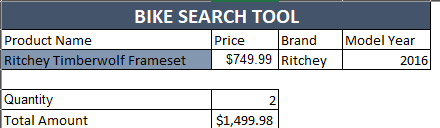
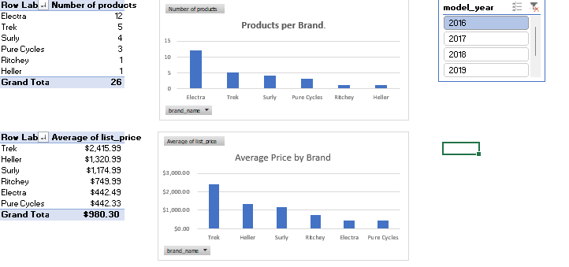

# 🚴 Bike Store Analytics: Dynamic Search & Sales Dashboard

### 📌 Project Overview
This project solves a common retail problem: efficient inventory management and pricing analysis. I built a dual-purpose Excel application that serves two user types:
1.  **Sales Staff:** A front-end "Search Tool" allowing instant retrieval of product specs, pricing, and stock status during customer interactions.
2.  **Management:** A back-end "Analytics Dashboard" providing high-level insights into brand distribution and pricing strategies.

### 📊 The Dataset
**Source:** Relational Retail Database (Proprietary/Mock Data)
**Size:** 3,000+ Records
**Structure:**
* **Products Table:** `product_id`, `product_name`, `list_price`, `model_year`
* **Brands Table:** `brand_id`, `brand_name`
* **Stocks Table:** Inventory counts by store location

### 🛠️ Tech Stack & Skills Applied
**Tool:** Microsoft Excel (Advanced)

#### 1. Application Development (The Search Tool)
* **Dynamic Lookups:** Engineered a search engine using `VLOOKUP` and `INDEX-MATCH` to link disparate datasets (Products ↔ Brands) based on user input.
* **Error Handling:** Implemented `IFERROR` wrappers to ensure a clean, professional UI that handles missing or incorrect search terms gracefully.
* **User Interface Control:** Utilized Data Validation (Dropdown Lists) and Cell Protection to prevent user error and breakages in the formula logic.

#### 2. Data Analysis & Visualization (The Dashboard)
* **Pivot Table Modeling:** Aggregated raw sales data to calculate key metrics like "Average Price per Brand" and "SKU Count by Category."
* **Interactive Slicers:** Connected multiple charts to a single Slicer control, enabling instant filtering by **Model Year** and **Category**.
* **Data Cleaning:** Sanitized the raw dataset by removing non-breaking spaces (ASCII 160) and correcting text-to-number formatting issues using data transformation tools.

### 📸 Project Previews

**1. The Search Tool (Front-End)**
*Allows staff to check prices and stock in <2 seconds.*

**2. The Analytics Dashboard (Back-End)**
*Provides management with pricing trends and inventory distribution.*

